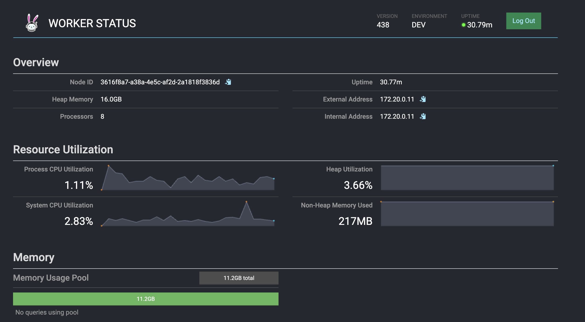

<link rel="stylesheet" type="text/css" href="style.css">

<!-- 
Author: Pirate-Emperor
Date: [Insert Date]
Description: README file for BigData Pipeline project.
-->

# BigData Pipeline


## Project Overview

BigData Pipeline is a local testing environment designed for experimenting with various storage solutions, query engines, schedulers, and ETL/ELT tools. The project includes:

- **Storage Solutions**: RDB, HDFS, Columnar Storage
- **Query Engines**: Trino
- **Schedulers**: Airflow
- **ETL/ELT Tools**: DBT

## Pipeline Components

| Pipeline Component | Version | Description                      | Port                         |
|--------------------|---------|----------------------------------|------------------------------|
| MySQL              | 8.36+   | Relational Database               | 3306                         |
| Hadoop             | 3.3.6+  | Distributed Storage               | namenode: 9870, datanode: 9864 |
| Trino              | 438+    | Distributed Query Engine          | 8080                         |
| Hive               | 3.1.3   | DFS Query Solution                | hiveserver2(thrift): 10002   |
| Kudu               | 2.3+    | Columnar Distributed Database     | master: 7051, tserver: 7050 |
| Airflow            | 2.7+    | Scheduler                         | 8888                         |
| DBT                | 1.7.1   | Analytics Framework               | -                            |

## Connection Info

| Pipeline Component | User    | Password | Database   |
|--------------------|---------|----------|------------|
| MySQL              | root    | root     | default    |
| MySQL              | airflow | airflow | airflow_db |
| Trino              | Allowing all | - | 8080      |
| Hive               | hive    | hive     | default    |
| Airflow            | airflow | airflow | -          |

You can create databases, schemas, and tables with these accounts.

## Execution

Apache open-source software is manually installed on an Ubuntu image, downloading from Apache mirror servers (CDN) to improve overall installation speed. The installation speed may vary based on the user's network environment, so a stable network is recommended.

- **MySQL**: For MySQL, the docker-compose file is set for Mac Silicon (platform: linux/amd64). If running on Windows, comment out this line.
- **Trino**: For Trino's Web UI/JDBC connections (e.g., DBeaver), any string can be used as the User. There is no password. Ensure that the user in `dbt-trino`'s `profiles.yml` matches this.
- **DBT**: DBT operates within Airflow using `airflow-dbt`. For local use, create a virtual environment. (Future plans include building improvements with poetry.)
- **Kudu & Hadoop**: For local environments with limited resources, the replica count for `kudu-tserver` and `hadoop-datanode` has been set to 1. Kudu is a storage-only DB, requiring a separate engine (e.g., Impala, Trino) for executing queries.
- **Hue**: If Hue is needed, uncomment the section in `docker-compose.yml` to use it.
- **Airflow**: Airflow is configured with the Celery Executor. `airflow-trigger` is restricted due to resource constraints.

## Getting Started

To get started with BigData Pipeline, follow these steps:

### 1. Start the Containers

- **1-1.** If you want to specify the required profile and bring up containers using the CLI:

  ```bash
  COMPOSE_PROFILES=trino,kudu,hive,dbt,airflow docker-compose -f docker-compose.yml up --build -d --remove-orphans
  ```

- **1-2.** If you want to bring up all containers at once:

  ```bash
  make up
  ```

### 2. Manage Containers

- **2-1.** If you want to stop running containers:

  ```bash
  make down
  ```

- **2-2.** If you want to remove running containers while deleting Docker images, volumes, and network resources:

  ```bash
  make delete.all
  ```

## Checking if It's Running Properly

- **Hive Metastore Initialization**: Check for an initialized file in the `./mnt/schematool-check` folder.
- **Container Start Success**: Look for the following image when running Docker Compose:

  

- **Web UI Access**: If you can’t access the web UI for a specific platform after container startup, you may need to rebuild the containers.

   
  <hr> 
   
  <hr> 
   
  <hr> 
   
  <hr> 
   
  <hr>

- **Trino JDBC Connection**: If you see three catalogs (hive, kudu, mysql) after JDBC connection (`jdbc:trino://localhost:8080`) in DBeaver, it is working correctly.

  

## Trino Test Code

Test codes are located in the `init-sql/trino` directory.

- **test_code_1.sql**: Tests schema and table creation, data insertion, and selection in the Hive catalog.

  

- **test_code_2.sql**: Tests Union queries between heterogeneous DB tables (Hive, Kudu).

  

## Next Challenge

- Enhance static analysis tools and build systems for clean code (black, ruff, isort, mypy, poetry).
- Improve CI automation for static analysis (pre-commit).
- Simulate ETL/ELT with DBT-Airflow integration.

## Contributing

Feel free to fork the repository, make changes, and submit pull requests. Contributions are welcome!

## License

This project is licensed under the MIT License. See the [LICENSE](LICENSE) file for details.

## Author

**Pirate-Emperor**

[](https://twitter.com/PirateKingRahul)
[](https://discord.com/users/1200728704981143634)
[](https://www.linkedin.com/in/piratekingrahul)

[](https://www.reddit.com/u/PirateKingRahul)
[](https://medium.com/@piratekingrahul)

- GitHub: [Pirate-Emperor](https://github.com/Pirate-Emperor)
- Reddit: [PirateKingRahul](https://www.reddit.com/u/PirateKingRahul/)
- Twitter: [PirateKingRahul](https://twitter.com/PirateKingRahul)
- Discord: [PirateKingRahul](https://discord.com/users/1200728704981143634)
- LinkedIn: [PirateKingRahul](https://www.linkedin.com/in/piratekingrahul)
- Skype: [Join Skype](https://join.skype.com/invite/yfjOJG3wv9Ki)
- Medium: [PirateKingRahul](https://medium.com/@piratekingrahul)

Thank you for visiting the BigData Pipeline project!

---

For more details, please refer to the [GitHub repository](https://github.com/Pirate-Emperor/BigData-Pipeline).